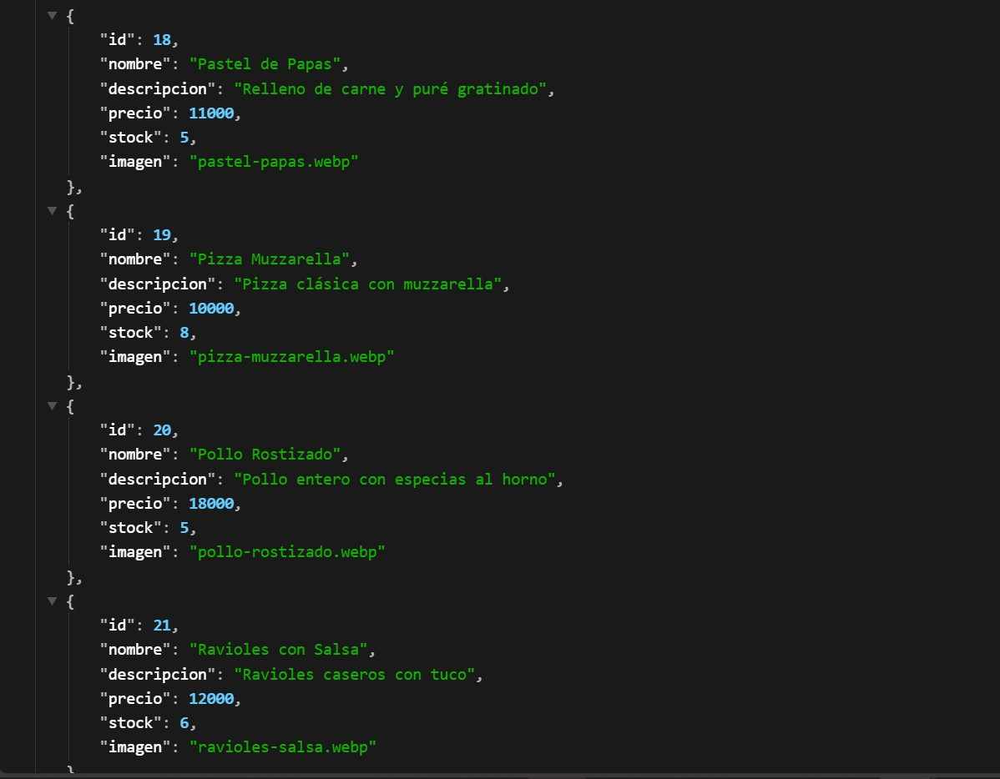
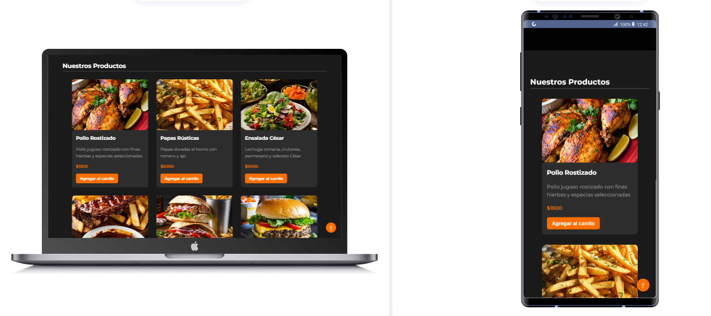

# API Simulada de Productos para e-Commerce Resto Bar

## Descripción:

Este repo funcionaría como una API simulada para un sitio web estilo e-commerce de un Resto Bar. Contiene un archivo `productos.json` con la información de los productos y una carpeta con las imágenes correspondientes.

Está alojado en GitHub Pages y permite al frontend de un sitio web consumir los datos de productos de manera realista usando `fetch()` en JavaScript. Sirve como fuente de productos para la sección del catálogo o tarjetas, carrito de compras, o cualquier funcionalidad relacionada.

## Estructura del Proyecto:

- `productos.json` → Contiene un array de productos con propiedades como:
  - id
  - nombre
  - descripción
  - precio
  - stock
  - imagen

- `img/productos/` → Contiene todas las imágenes de los productos listados en el JSON.

## Cap:



## ¿Para qué sirve?:

- Para simular una API REST sin necesidad de backend.
- Permite integrar productos dinámicamente en sitios frontend con JavaScript.
- Es útil para proyectos académicos, pruebas de desarrollo o demostraciones que necesitan datos dinámicos sin montar/levantar un servidor.

## Cómo usarlo

1. En tu proyecto frontend, consumir los datos así:

```js
fetch('https://D3M4rc0.github.io/API-Productos-Resto/productos.json')
  .then(res => res.json())
  .then(productos => {
    // Usar los productos aquí
  });
```

## Cap:



seccion-productos.png

2. Para mostrar imágenes desde la API:

```html

```

## Observaciones:

   · Esta API es de solo lectura (GET).

   · No permite POST, PUT ni DELETE porque está alojada como contenido estático.

   · Los productos deben agregarse o editarse manualmente en el archivo productos.json


